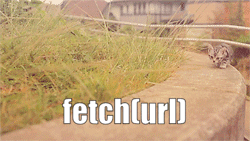

# The Cat API

Whiskas nos ha contratado para implementar una App que, cada vez que hacemos clic en el botón, nos trae de The Cat Api una nueva imagen de un gato. Debemos establecer la imagen en el contenedor adecuado, y además, la anchura y altura de la misma.

## Preguntas previas

1. ¿Porque podemos ver un texto 'un gato' al cargar la app por primera vez?
2. ¿Cuál es la URL que nos va a proporcionar un gato aleatório?
3. Describe con exactitud el tipo de dato que devuelve esta API

## Ejercicio y evaluación

1. Asocio correctamente el evento clic al botón - **1 pt.**
2. Cada vez que pulsamos el botón, se hace una llamada a la API - **1 pt.**
3. Muestro por consola el resultado de la llamada a la API - **1 pt.**
4. La imagen de un nuevo se ve en el contenedor adecuado al hace clic - **1 pt.**
5. La imagen del gato tienen la anchura y altura que proporciona la API - **1 pt.**

Atención, para el último punto, debes comprobar que efectivamente se establecido la anchura y la altura de la imagen usando el inspector de estilos

 

### BONUS DOG-NO-BULLING (no puntuable)

Si tras completar toda la evaluación te queda tiempo, implementa esta funcionalidad nueva.

1. Crea un [selector](https://www.w3schools.com/tags/tag_select.asp) para escoger entre perros y gatos.
2. La [API](https://developers.thecatapi.com/view-account/ylX4blBYT9FaoVd6OhvR?report=8FfZAkNzs) debe recuperar un perro o un gato, en función del animal escogido.
